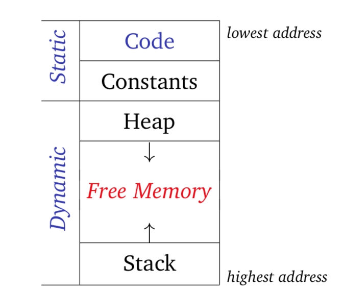
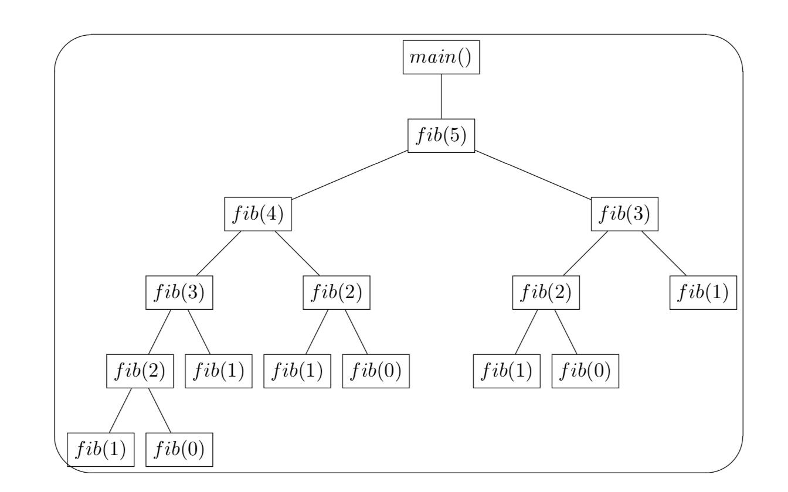

# Activation records / Stack frames

## Stack Pointer & Frame Pointer
1. Stack Pointer: contains the address of either the last used location or the next unused location on the stack.
2. Frame Pointer: points into the activation record of a subroutine so that any objects allocated on the stack can be referenced with a static offset from the frame pointer.
3. Stack and heap structure in the memeory:
{:height="50%" width="50%"}

## Calling Convention
1. Caller: function or procedure who makes the function call
2. Callee: function or procedure has been called
### Calling sequence
Def. the conventional sequence of instructions that call and return from a procedure.

a. Prologue: management code executed at the beginning of a subroutine call.
- Pass parameters, save return address, update static chain, change PC counter, move SP, save register values, move FP, initialize objects...

b. Epilogue: management code executed at the end of a subroutine call.
- Finalize objects, pass return value back to caller, restore...

**Q: Are there advantages to having the caller or callee perform various tasks?**
If possible, have the callee perform tasks: task code needs to occur only once, rather than at every call site.

## Activation trees and execution procedure
Consider this code example:
```c
int fib (int n) { 
     int t, s;
     if (-1 < n && n < 2) return n; 
     s = fib(n−1);
     t = fib(n−2);
     return s+t;
}
```
Q: If you plan to call this function as `fib(5)`, what is the real sequence of steps on the stack during the execution?
Using the activation trees to represent the steps.

### Activation trees
Def. A tree structure to represent the sequence of steps. Execution corresponds to depth-first traversal of the activation tree.
Consider the previous function call, it will have this activation tree:
{:height="50%" width="50%"}

# Parameter passing modes

## Types of parameters
1. Formal parameter: names / variables that appear in the declaration of the subroutine.
2. Actual parameter: the expressions passed to a subroutine at a particular call site.

```C++
void func (int x, int y) { // x and y are formal parameters
...
}
int a = 0, b = 0; 
func(a, b); // a and b are actual parameters
func(a+b, atoi("10")); // a+b and atoi("10") are acutual parameters
```

## Evaluation strategy

### Strict Evaluation
1. Call by value
  - Formal is bound to copy of value of actual
  - Assignment to formal, if allowed, changes value at location of local copy, not at location of the actual that stores the original value.
2. Call by reference
  - Formal is bound to location of actual, forming an alias
  - Assignment to formal, if allowed, also affects actual
  - Only works if actual evaluates to a l-value (l-value: value refers to memory location)

### Lazy Evaluation
1. Call by name
  - Formal is bound to *expression* of actual
  - Expression is evaluated **each time** formal is read when executing
  - Algol 60 allows assignment to formal if actual is a variable (actual should be a l-value)
  - not common for doing an assginment in recent languages, usually cannot assign to formal

2. Call by need
  - Formal is bound to *expression* of actual
  - Expression is evaluated **only the first time** its value is needed
  - Subsequent reads from the formal will use the value computed earlier
  - Algol 60 allows assignment to formal if actual is a variable (actual should be a l-value)
  - not common for doing an assginment in recent languages, usually cannot assign to formal
  
###  How to calculate the values of several variables in the parameter passing modes? 

1. Call by value --- values are copied by actual parameters when they pass.

2. Call by reference --- formal parameter is the actual one (change formal also change actual).

3. Call by name --- formal parameter is bound by expression (execute formal by executing the expression), the parameter is evaluated until it will be used.

### Sample Question
Consider this following code:
```scala
def f(x: Int, y: Int) {
  x = y + 1
  println(x + y)
}

var z = 1
f(z, {z = z + 1; z})
println(z)
```
What does this program print if we make the following assumptions about the parameter passing modes for the parameters `x` and `y` of `f`:

1. `x` and `y` using call-by-value parameter
```
5
2
```

2. `x` is call-by-reference and `y` is call-by-value
```
5
3
```

3. `x` is call-by-value and `y` is call-by-name
```
6
3
```

4. `x` is call-by-reference and `y` is call-by-name
```
7
4
```

### Notes
If you plan to see more examples, please check [this page](https://courses.cs.washington.edu/courses/cse341/03wi/imperative/parameters.html).

## Function passsing

### Evaluation strategy

1. Deep binding: When a subrountine is declared, it will create a closure that storing function information and environment. When it is called (used), the referencing environment from when the closure of that function created is restored.
  - Closure: a record stroing function together with an environment.
  - Environment: a mapping associating each free variable of the function (variables that are used locally, but defined in an enclosing scope) with the value or reference to which the name was bound when the closure was created.
  - Free variable: variable is not defined by the current function.

2. Shallow binding: When a subroutine is called, it uses the current referencing environment at the call site.

### Exercise
```Scala
def f (i: Int, g: () => Unit):Unit = {
  def h():Unit = println(i)
  if (i > 1) g()
  else f(i+1, h)
}

def c():Unit = ()

f(1, c)
```
What does this program print if we make the following assumptions about the parameter passing:

1. This code is running under static scoping and deep binding.
```
1
```
2. This code is running under dynamic scoping and shallow binding.
```
2
```
