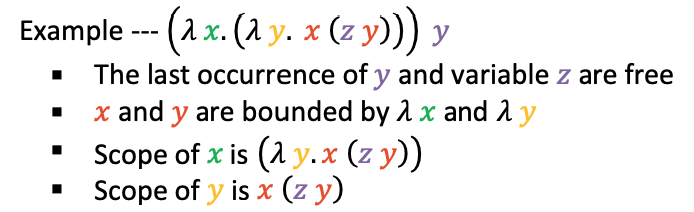

# Lambda Calculus
Def. a mathematical logic for expressing computation based on fucntion abstraction and application.
Formula. 
Think lambda calculus as function:
```javascript
λ x. t => def f (x) { t }
```
## Syntax for a term
1. Variable --- `x`
    - A character or string representing a parameter or mathematical/logical value.
2. Abstraction --- `λ x. t`
    - `t` is lambda term (function term) and body for that abstraction.
    - formal parameter `x` becomes bound in the expression.
3. Application --- `t1 t2`
    - Applying a function to an argument.
    - An application of a function `t1` to an argument `t2`.

## Precedence and associative
1. Precedence: application has higher precedence than lambda abstraction.
2. Associative: applications are left associative.
3. Example:
```
λ x y. x y (λ x. y) ⟺ λ x y. ((x y)  (λ x. y))
```

## Binding and Variables
1. Binding and scope
  - Scope: the scope of a parameter is its lambda function term.
  - Binding: In a lambda term, if the name of a variable is occurred in the parameter list, that variable is bounded by current term.
2. Variable
  - Bound variable: a variable is bounded by a lambda abstraction.
  - Free variable: a variable is not bounded by a lambda abstraction.
3. Example:
<p align="center">

</p>
**Question: How to determine the free variable?**
Think about this question like how to determine variable scoping (static). 

## Alpha renaming (α convension)
Def.
1. Renaming rule
2. 

## β reduction
Def.

2. Evaluation strategy 
# Scheme Programming
vv
