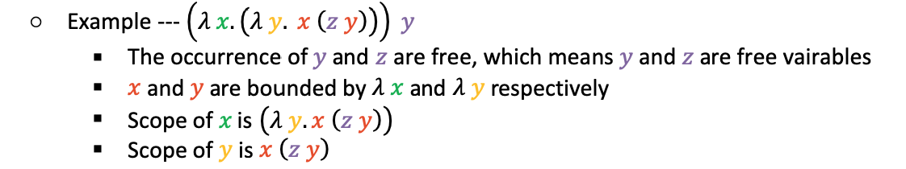

# Midterm Preparation

## Regular Expression
- Syntax
    - Basic:
        - `ε`: represents an empty string, `ε` matches no characters string (empty string).
        - `a`: a single character, `a` matches a string containing only the character a.
    - Concatenation (sequencing): `RS` denotes the set of strings that can be obtained by concatenating a string in `R` and a string in `S`.
        - `RS = { αβ | α ∈ R, β ∈ S }`
    - Alternation: a vertical bar `|` separates alternatives.
        - `a|b` matches `a` or `b`.
    - Repetition:
        - `*`(Kleene star): the set of strings which are concatenations of zero or more occurrences of the preceding element.
            - `a*b` matches `b`, `ab`, `aab` and so on.
        - `+`: the set of strings which are concatenations of one or more occurrences of the preceding element.
            - `a+b` matches `ab`, `aab`, `aaab` and so on.
            - `a+` = `aa*`

### Exercise
1. Write an regular expression that matches the positive float point number with the following restriction:
```
Match:
1.2
0.35
0.007
0.0
Not match:
+1.2
-3.4
01.23
3
0
```

   <details><summary>Solution</summary>
     <p>
     
     ``` 
     6
     ```
     </p></details>

## Context Free Grammar
- Terminals: the set of the alphabet of the language
- Nonterminals: the set of variables, each variable represents a different type of phrase or clause in the sentence
- Productions: rules for replacing a single non-terminal with a string of terminals and non-terminals
- Starting symbol: a nonterminal, used to represent the whole sentence (or program)
### Exercise

## Static vs. Dynamic Scoping


### Exercise

## Parameter Passing Modes


## Lambda Calculus

### Exercise
Consider the church encoding, we know that:
```
true = (λ x y. x)
false = (λ x y. y)
0 = (λ s z. z)
1 = (λ s z. s z)
succ = (λ n s z. s (n s z))
pair = (λ x y b. b x y)
fst = (λ p. p true)
snd = (λ p. p false)
pred = λ n. snd (n (λ p. pair (succ (fst p)) (fst p)) (pair 0 0))
```
**Question: How do we compute `pred 1` to get `0` via beta reduction?**
```
    pred 1
=> (λ n. snd (n (λ p. pair (succ (fst p)) (fst p)) (pair 0 0))) 1        ; by def of pred
=> ...
```

## Scheme Programming

### Exercise
2. `foldl`: define a function `foldl` that traverse the list from the begin to the end and recursively fold the list into a single value. So, this function will take a function `f` as parameter, a single value `z` and a list `ls` for traversal. Moreover, for fuction `f`, it will takes two value, the first is an element in the list `ls` and second is the single value `z`.
For instance:
```scheme
> (foldl + 0 '(1 2 3 4)) ; sum of the list
10
> (foldl (lambda (x z) (+ 1 z)) 0 '(1 2 3 4)) ; length of the list
4 
```
- Intuition: Your implementation should iterate the list `ls` and recursively call function `foldl` to fold the list into a single value as `f (car ls) z` as `z` for next iteration.
Here is an example that how `foldl` works:
<p align="center">

</p>

- Sample code:
```scheme
(define (foldl f z ls)
  (cond
    ((null? ls) z)
    (else (foldl f (f (car ls) z) (cdr ls)))
    )
)
```
You can also use `foldl` for defining `rev`:
```scheme
(define (rev ls) (foldl cons '() ls))
```

```
<p align="center">

</p>
```
