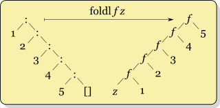

# Midterm Preparation

## Regular Expression
- Syntax
    - Basic:
        - `ε`: represents an empty string, `ε` matches no characters string (empty string).
        - `a`: a single character, `a` matches a string containing only the character a.
    - Concatenation (sequencing): `RS` denotes the set of strings that can be obtained by concatenating a string in `R` and a string in `S`.
        - `RS = { αβ | α ∈ R, β ∈ S }`
    - Alternation: a vertical bar `|` separates alternatives.
        - `a|b` matches `a` or `b`.
    - Repetition:
        - `*`(Kleene star): the set of strings which are concatenations of zero or more occurrences of the preceding element.
            - `a*b` matches `b`, `ab`, `aab` and so on.
        - `+`: the set of strings which are concatenations of one or more occurrences of the preceding element.
            - `a+b` matches `ab`, `aab`, `aaab` and so on.
            - `a+` = `aa*`

### Exercise
1. Write an regular expression that matches the positive float point number with the following restriction:
```
Match:
1.2
0.35
0.007
0.0
Not match:
+1.2
-3.4
01.23
3
0
```

**Solution:**
    <p>

```
([1-9][0-9]*|0)\.[0-9]+
```
   </p>

## Context Free Grammar
- Terminals: the set of the alphabet of the language
- Nonterminals: the set of variables, each variable represents a different type of phrase or clause in the sentence
- Productions: rules for replacing a single non-terminal with a string of terminals and non-terminals
- Starting symbol: a nonterminal, used to represent the whole sentence (or program)
### Exercise
Provide a context free grammar over the alphabet {`a`,`b`} such as:
1. `a` followed by `b` and the number of `a`'s is more than number of `b`'s:
```
a
aab
aaab
aaaaabbb
...
```
**Solution:**
    <p>

```
S -> aA
A -> aA | B
B -> aBb | ε
```
   </p>

2. Challenge yourself to consider all strings with more a’s than b’s:
```
a
bbabaaa
ababaab
aba
baaaa
...
```
**Solution:**
    <p>

```
S -> aA | MS | SMA
A -> aA | ε
M -> MM | bMa | aMb | ε

```
   </p>

- Here is the [website](https://web.stanford.edu/class/archive/cs/cs103/cs103.1156/tools/cfg/) for testing the correctness of CFG.

## Static vs. Dynamic Scoping
1. Static scoping: binding of a name is determined by rules that refer only to the program text. (i.e. its syntactic structure)
2. Dynamic scoping: binding of a name is given by the most recent declaration encountered during run-time.

### Exercise
Consider this code snippet:
```c
int a = 0, b = 0, c = 0;
void q();

void p() {
    int a = 1;
    b = 1;
    c = a + b;
    a = c + b;
    q();
}
void print() { printf("%d %d %d\n", a, b, c); }

void q() {
    int b = 2;
    a = 2;
    c = a + b;
    b = c + a;
    print();
}

int main()
{
    int c = 3; 
    p();
    print();
    return 0;
}
```
1. In c programming, we know that c is using static scoping. What does this program print when it runs?
**Solution:**
    <p>

```
2 1 4
2 1 4
```
   </p>

2. Now assume the program is running under dynamic scoping. What does this program print?
**Solution:**
    <p>

```
2 6 4
0 1 4
```
   </p>


## Parameter Passing Modes
1. Strict evaluation: call-by-value, call-by-name
2. Lazy evaluation: call-by-name, call-by-need

### Exercise
Consider this following code:
```c++
int z = 1;

/*Note: evaluations for addition and printf are both left_to_right*/

void f(int x, int y) { // suppose formal could be assigned
    x = y + z;
    printf("%d %d\n", x, y);
}

f(z, {int x = z; z = x + 1; z});
printf("%d\n", z);
```
What does this program print if we make the following assumptions about the parameter passing modes for the parameters `x` and `y` of `f`:

1. `x` and `y` using call-by-value parameter
<details><summary>Solution</summary>
    <p>

```
4 2
2
```
   </p>
</details>

2. `x` is call-by-reference and `y` is call-by-value
<details><summary>Solution</summary>
    <p>

```
4 2
4
```
   </p>
</details>

3. `x` is call-by-value and `y` is call-by-name
<details><summary>Solution</summary>
    <p>

```
4 3
3
```
   </p>
</details>

4. `x` is call-by-reference and `y` is call-by-name
<details><summary>Solution</summary>
    <p>

```
4 5
5
```
   </p>
</details>

## Lambda Calculus

### Exercise
1. Determine the set of free variables inside this lambda expression:
```
(λ x. (λ y. x) y (λ x. x)) (λ z. z) x
```
Moreover, show an alpha-renaming of the term such that no variable is bound more than once.
<details><summary>Solution</summary>
    <p>

```
free variable: y, x
after renaming: (λ x1. (λ y. x1) y (λ x2. x2)) (λ z. z) x
```
   </p>
</details>

2. Consider the church encoding, we know that:
```
true = (λ x y. x)
false = (λ x y. y)
0 = (λ s z. z)
1 = (λ s z. s z)
succ = (λ n s z. s (n s z))
pair = (λ x y b. b x y)
fst = (λ p. p true)
snd = (λ p. p false)
pred = λ n. snd (n (λ p. pair (succ (fst p)) (fst p)) (pair 0 0))
```
How do we compute `pred 1` to get `0` via beta reduction?
```
    pred 1
=> (λ n. snd (n (λ p. pair (succ (fst p)) (fst p)) (pair 0 0))) 1        ; by def of pred
=> ...
```

## Scheme Programming

### Exercise
1. `foldl`: define a function `foldl` that traverse the list from the begin to the end and recursively fold the list into a single value. So, this function will take a function `f` as parameter, a single value `z` and a list `ls` for traversal. Moreover, for fuction `f`, it will takes two value, the first is an element in the list `ls` and second is the single value `z`.

For instance:
```scheme
> (foldl + 0 '(1 2 3 4)) ; sum of the list
10
> (foldl (lambda (x z) (+ 1 z)) 0 '(1 2 3 4)) ; length of the list
4 
```
- Intuition: Your implementation should iterate the list `ls` and recursively call function `foldl` to fold the list into a single value as `f (car ls) z` as `z` for next iteration.
Here is an example that how `foldl` works:
<p align="center">

</p>

- Sample code:
```scheme
(define (foldl f z ls)
  (cond
    ((null? ls) z)
    (else (foldl f (f (car ls) z) (cdr ls)))
    )
)
```
You can also use `foldl` for defining `rev`:
```scheme
(define (rev ls) (foldl cons '() ls))
```

2. `pack`: define a function `pack` that packs consecutive duplicates of list elements into sublists.

For example:
```scheme
> (pack '(a a a a b c c a a d e e e e)) 
((a a a a) (b) (c c) (a a) (d) (e e e e)) 
```

<details><summary>Sample code</summary>
    <p>

```scheme
; foldr
(define (foldr f s L)
(if (null? L) s (f (car L) (foldr f s (cdr L)))))

; pack
(define (pack ls)
  (cond
    ((null? ls) '())
    (else (foldr (lambda (x z)
      (cond
          ((null? z) (cons (cons x '()) z))
          ((= x (caar z)) (cons (cons x (car z)) (cdr z)))
          (else (cons (cons x '()) z))
      )) '() ls)
    )
  )
)
```
   </p>
</details>

3. `split`: define a function `split` that splits an input list into two parts by given a length of the first part.

For instance:
```scheme
> (split '(a b c d e f g) 3)
((a b c)(d e f g))
```

<details><summary>Sample code</summary>
    <p>

```scheme
; split
(define (split ls n)
  (letrec ((split-rec (lambda (ls n res)
      (cond
        ((= n 0) (append res (cons ls '())))
        (else (split-rec (cdr ls) (- n 1) (cons (append (car res) (list (car ls))) (cdr res)))))
  )))
  (split-rec ls n '(())))
)
```
   </p>
</details>
