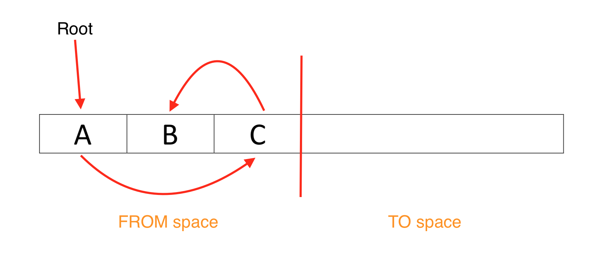
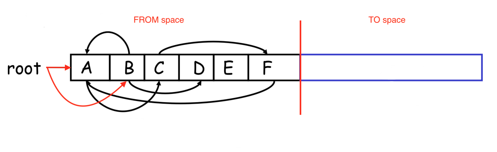
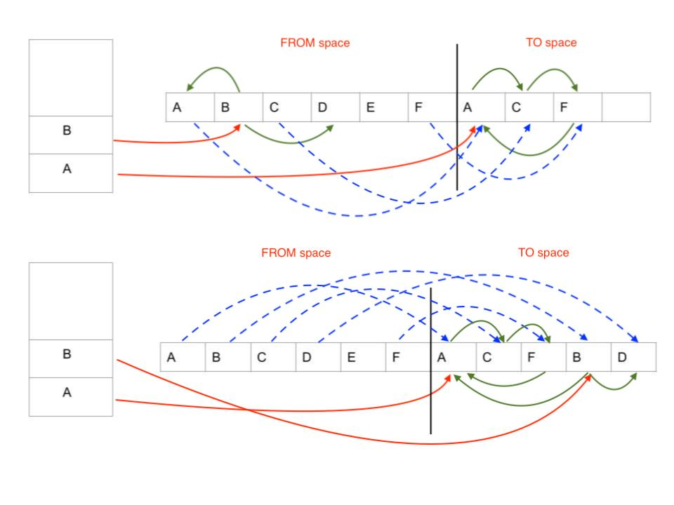

# ML
## Installation
You can use [this](https://www.smlnj.org/) website to download standard ml. Or in Mac OS, open terminal and type this command:
```
brew install smlnj
```
Once installed, use `sml` in your terminal.

You can also write a file of your assignment by using `.sml` extension. After named SML source file, open the compiler and type this:
```
- use "<name>.sml";
```

## Pattern matching
- Def. the act of checking a given sequence of tokens for the presence of the constituents of some patterns.
    - Think about "match a variable with certain cases and for each case, you will do several actions based on that case".
    
### Kinds of pattern in SML
- Constant `c` --- `1`, `"this"`, `()`, `{}`...
- Wildcard `_` --- match any value
- Variable pattern `x` --- match any value that binds variable `x`
- Tuple pattern: `(p1, p2, ..., pn)` – match a tuple that contains elements matched by the patterns `p1` to `pn`
- List pattern:
    - [] --- an empty list
    - (hd::tl) --- a list with an element bound by variable `hd` and the remain list bound by vairable `tl`
- Variable binding pattern `x as p` --- match pattern `p` that binds as a variable `x`
    
### Format
- Standard format: 
```sml
case <exp1> of
<pattern> => <exp>
| <pattern> => <exp>
| · · · · · · · · ·
| <pattern> => <exp>
```
For example, define a function that calculates the length of the list:
```sml
fun len l = 
    case l of
    [] => 0
    |(hd::tl) => 1 + (len tl)
```
If you want to match multiple variables, you can make `<exp1>` as a tuple --- `<arg1>, <arg2>, ..., <argn>`
- Special case for only matching the parameters of a function: 
```sml
fun name <pattern> = · · ·
| name <pattern> = · · ·
| · · ·
```
In this format of pattern matching, you can match multiple arguments inside `<pattern>` by considering different combined cases. For instance:
```sml
fun short_circuit_eval false _ = false
    | short_circuit_eval true false = false
    | short_circuit_eval true true = true
```

## Algebraic datatypes
- Def. a kind of compisite type, where a type formed by combining other types
    - A type could be constructed by other types

For example, you can define a datatype for a binary tree like this:
```sml
datatype tree =
    Leaf
  | Node of int * tree * tree
(* Polymorphic ADTs *)
datatype 'a btree = (* 'a is a type parameter *)
      Empty 
    | Node of 'a * 'a btree * 'a btree
datatype ('a, 'b) bktree =
      Empty 
    | Node of 'a * 'b * ('a, 'b) bktree * ('a, 'b) bktree
```

Once you have this datatype, you can make a binary tree as:
```sml
val t1 = Node(3,Node(1,Empty,Node(2,Empty,Empty)),Node(4,Empty,Empty))
val t2 = Node("Btree", Empty, Empty)
(* However, you can't make a binary tree with arbitrary datatype*)
(*
val t3 = Node("Btree", Empty, Node(1,Empty,Empty)) ; overload conflict
*)
```

### Option type
One of the predefined ADTs of SML is the `option` type:
```sml
datatype 'a option = NONE | SOME of 'a
```
This type is very useful when you try to search or find a value but may not always have a defined return value. For instance, here is how we can implement a function to find the value in a binary search tree, if such a value exists:
```sml
fun find t k = case t of
    Empty => NONE
  | Node (v, left, right) =>
    if v = k then SOME v
    else if v > k then find left k
    else find right k
```

### Exercise
1. Write a function that insert a new tree Node to a binary search tree:
```sml
(* function signature *)
val insert = fn : int btree -> int -> int btree
(* For example *)
- val t1 = Node(1, Empty, Empty);
- insert t1 3;
val it = Node (1,Empty,Node (3,Empty,Empty)) : int btree
- insert t1 0;
val it = Node (1,Node (0,Empty,Empty),Empty) : int btree
```

<details><summary>Solution</summary>
    <p>

```sml
fun insert t i =
   case t of
    Empty => Node (i,Empty,Empty)
   | Node (i',l,r) =>
        if (i < i') then Node (i',insert l i,r)
        else Node (i',l,insert r i)
```
   </p>
</details>
2. How to define a List by using ADTs?

**Solution:**
    <p>

```sml
datatype 'a mylist = 
    Nil
  | Cons of 'a * 'a mylist

fun len Nil = 0
  | len (Cons (hd,tl)) = 1 + len tl
```
   </p>


### Notes
- If you plan to overview the syntax of SML, please find [this](https://learnxinyminutes.com/docs/standard-ml/) webpage for more details.
- Here is a [tutorial](https://www.classes.cs.uchicago.edu/archive/2007/winter/22610-1/docs/sml-tutorial.pdf) for SML, hope it helps for your review.

# Memory Management and Garbage Collection

## Memory management
In a program, the memory used to store the data and code at run-time typically is split into three pieces:
- Data segment: stores objects whose life cycle lives the entire program execution
    - E.g. Global variables, code of program etc.
- Heap: store the values of objects whose life cycle is dynamic
    - The lifetime of objects 
    - Managed by the programmer
        - Use after free occurs --- access a dangling pointer
        - Double free errors --- deallocating objects multiple times
        - Memory leaks --- not deallocating after no longer used
    - Automatically by the language
        - Garbage collection
        - Reference mounting
        - Ownership types
- Stack: store the values of local variables in function activation records
    - Using stack is preferred because low overhead, allocated data is freed when data is no needed
    - Objects that are allocated on the stack cannot change their size dynamically

## Garbage collection
- Def. an automatic memory management. A garbage collector attempts to reclaim the memory occupied by objects that are no longer in use by the program.

### Copying
- Intuition
    - Two parts: FROM space, TO space
    - Objects allocated in FROM space
    - When FROM space is full, run GC()
    - During traversal, each encountered object is copied TO space
    - When is done, all live objects are in TO space
    - Swap FROM space and TO space
    - By leaving a forward address, any pointers to the moved objects will be updated.
- Algorithm
```c++
GC()
  for each root pointer p do
    p := traverse(p);
    
traverse(p)
  if *p contains forwarding address then
    p := *p;  // follow forwarding address
    return p;
  else 
    new_p := copy (p, TO_SPACE);
    *p := new_p; // write forwarding address
    for each pointer field p->x do
      new_p->x := traverse(p->x);
    return new_p;
```
**Question:** How does the `traverse` work? Consider the following example:
<p align="center">

</p>

Suppose the root pointer now points to object `A`. Draw the FROM and TO space after the call of `GC()`. 


#### Exercise
Consider this FROM heap, assume the root pointer points to objects `A`, `B`. Draw the FROM and TO space after the call to `traverse` for each of the roots. To be clear, you should draw 2 heaps (each with FROM and TO space) with forwarding address pointers.
<p align="center">

</p>


<details><summary>Solution</summary>
<p align="center">

    </p>
</details>
