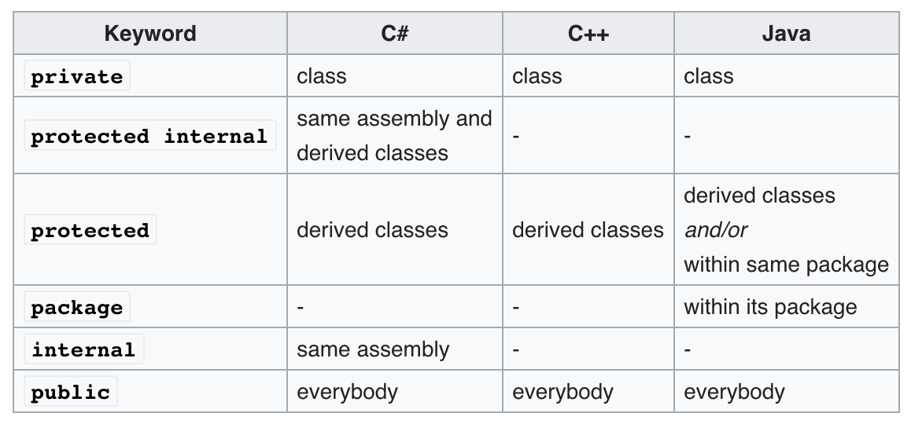

# Object-oriented programming
- Def. a programming paradigm based on the concept of "objects".
- Difference between OOP and OBP: Object-based programming does not support inheritance or subtyping.

## Class OOP
### Class
- Class is always viewed as a template ('blueprint') to create objects.
- Components
    - Data, in the form of fields, often known as attributes.
    - Code, in the form of procedures, often known as methods.
        - Constructor: a method for object's initilization.
            - Types: [Java](https://beginnersbook.com/2013/03/constructors-in-java/), [C++](https://www.geeksforgeeks.org/constructors-c/)
        - Destructor: a method for object's deletion.
```c++
class Point {
public:
  Point(double fst, double snd) { // Constructor
      this->first = fst;
      this->second = snd;
  }
  void print () { // Method
      cout<<"("<<first<<", "<<second<<")"<<endl;
  } 
  ~ Point() { } // Destructor
private:
  double first; // Attribute
  double second;
};
```
### Information hiding (Encapsulation)
- Def. a machanism for restricting direct access to some of object's components.
- Common access modifiers: private, protected and public.
- Table for the access modifier:
<p align="center">

</p>

### Object for class
- Def. a particular instance of a class, where the object can be a combination of variables, functions, and data structures.

## Inheritance and Subtype Polymorphism

### Inheritance
- Def. a mechanism to derive a class (subclass) from another class (superclass) for a hierarchy of classes that share a set of attributes and methods.
- Variants (`<-`, inherits)
    - Single inheritance: `B <- A`
    - Multiple inheritance: `C <- A`, `C <- B`
    - Multilevel inheritance: `C <- B <- A`
- Substitution Principle
    - The type of a subclass (inherited) can extend the type of its superclass by adding new members (attributes and methods).
    - Objects that belong to the subclass can be used whenever an object of the superclass is expected.
### Overiding methods (Polymorphism)
- Def. a feature that allows a subclass or child class to provide a specific implementation of a method that is already provided by one of its superclasses or parent classes.

### Static vs. Dynamic Types
- Static type: the type that the compiler infers or programmer declares for that expression at **compile-time**.
- Dynamic type: the actual type of the value obtained when the expression is evaluated at **run-time**.
- Consider the following example:
```Java
class A{
  A() { x = 0; z = 0;}
  public int m() { return x; }
  public int x;
  private int z;
}

class B extends A {
  B() { x = 1; y = 2;}
  @Override
  public int m() { return x + y;}
  public int y;
}

class Main {
  public static void main(String[] args) {
    A a = new B();
    // int z = a.y; // Not allowed
    System.out.printf("The result of m should be: %d\n", a.m());
    A act_a = new A(); // sizeof(act_a) == sizeof(a)?
  }
}
```
When you execute `A a = new B();`, the static type for object `a` is `A`, which means object `a` could **only access** the components from class `A`. However, the dynamic type for variable `a` is `B` and it will refers as a `B` instance (object). When you allocate memory to `a` on the heap, the size for object `a` is the same size as an object for class `B`. 

### Dynamic dispatch
- Def. the process of selecting which implementation of a polymorphic operation to call at run time.
- Variants **[Very Importent]!!!**
    - In Java, every non-static method is by default virtual method except final and private methods.
        - The methods which cannot be inherited for polymorphic behavior is not a virtual method.
    - In C++, explicitly use [virtual function](https://www.geeksforgeeks.org/virtual-function-cpp/) to achieve this.
- [Static dispatch](https://en.wikipedia.org/wiki/Static_dispatch).
    - a form of polymorphism fully resolved during compile time.
    - uses for non-virtual functions in C++.
    - uses for static methods or methods with final or private keyword in Java.
    - At compile time, these methods' call are the same as normal functions' call.
        - fetch method pointer -> make a call
- Object data layout in memory
    - Order by declaration.
    - Each data member can be accessed via a fixed offset from the base address of the data layout.
    - Subclass objects have the same memory layout as superclass objects with additional space for the subclass members that succeeds the space for the superclass members.
    - Here are the data layouts for objects `a` and `act_a`:
    ```diff
    !Objects' data layout in memory

    A Instance (act_a):
        ┌─────────────┐
        │    x = 0    │
        ├─────────────┤> members of A
        │    z = 0    │
        └─────────────┘
    B Instance (a):
        ┌─────────────┐
        │    x = 1    │
        ├─────────────┤> members of A
        │    z = 0    │
        ├═════════════┤
        │    y = 2    │> additional members of B
        └─────────────┘
    ```
**Q: How to inherit the methods?**
- Approach as data.
    - for each object, we have to add every method during memory creation.
- Virtual table.

#### Virtual method Table (Vtable)
- Def. each class has its own vtable which is shared by all instances of that class.
    - Inside this table, it contains an array of pointers to functions that implement the virtual methods of the class.
    - Pointers to functions are order by declaration.
- The data layout could access vtable by adding one member variable called virtual pointer.
    - When a call to virtual method, the run-time system looks up the vtable of the instance's dynamic type via the vpointer, and then looks up the method's implementation for that type via the corresponding pointer in the vtable.
        - fetch vpointer -> fetch method pointer -> make a call
- Inheritance:
    - A vtable for subclass is created by copying the vtable from superclass and changing the pointers of overridden methods to point to the new implementation.
    - When instance creates, the vpointer of that instance will be set to the right vtable of the instance's class.

**Example**

Consider the following Java code:
```java
class A {
    private A m1(){
      System.out.println("A.m1()");
      return new A();
    }
    public void m2(){
      System.out.println("A.m2()");
    }
    public A m3() {
      System.out.println("A.m3()");
      return this;
    }
    public A m4() {
      return this.m1();
    }
  }
  
  class B extends A {
    private B m1(){
      System.out.println("B.m1()");
      return new B();
    }
    
    @Override
    public void m2() {
      System.out.println("B.m2()");
    }
  }

class Main {
  public static void main(String[] args) throws Exception {
    A a1 = new B();

    A a2 = a1.m4();

    a2.m2();

    A a3 = a1.m3();

    a3.m2();
  }
}
```
1. What are the static and dynamic types of `a1`, `a2` and `a3`?
2. What methods are the call `a2.m2()`, `a1.m3()` and `a3.m2()` dispatched to?

## Prototype OOP
- Def. Object is not related to class. It could be created as an empty object or cloned from an existing object (prototype object).
- Objects inherit directly from other objects through a prototype property.
    - `__proto__` in JavaScript.
- Cloning (inheritance) is performed by behaviour reuse.
    - A process of reusing existing objects via delegation that serve as prototypes.
        - Delegation: refers to evaluating a member (property or method) of one object in the context of another original object.
```js
var foo = {one: 1, two: 2};
var bar = Object.create( foo ); // bar = clone(foo)
bar.one; // return 1, bar refers foo.a
bar.three = 3; // add new field
bar.two = "this is two"; // add new field two, and shadow proto object's two
bar;
/*
three: 3
two: "this is two"
__proto__:
    name: "foo"
    one: 1
    two: 2
*/
```

## Note
1. There is one great [explanation](https://stackoverflow.com/a/34462741/4608339) of static/dynamic dispatch in C++, hope it help you understand the difference.
