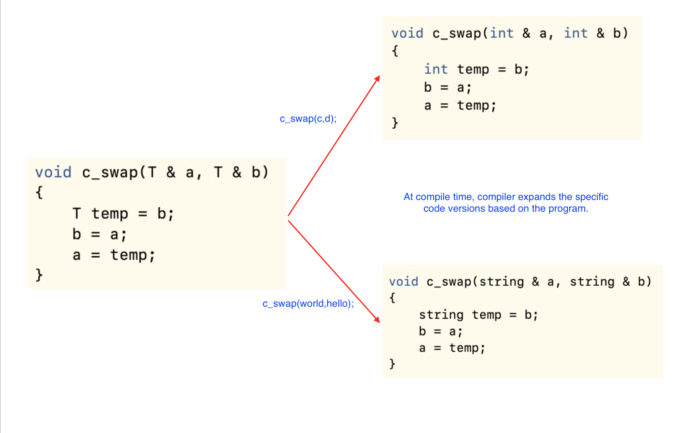

# Final Exam Preparation

## Functional Programming - ML

### Exercise
1. For each of the following functions, infer whether they are well-typed. If yes, provide the type of the function. Otherwise, explain the type error.
```sml
(*a*) fun fg x = if x then x andalso x else x + 1
(*b*) fun fi f = f true + f 0
(*c*) fun l NONE = false
          | l (SOME x) = x + 1
(*d*) 
```

<details><summary>Solution</summary>
    <p>

```
(a) In else branch, the variable x has bool type but operand + expects x be an int type.
(b) The function `f true` forces `f` to be a type of the form `bool -> 'a`, but `f 0` strengths it to be `int -> 'b` for some `'b`.
(c) The return type of the function l are not the same. The first case returns a boolean, but second one returns an integer.
(d)
```
   </p></details>

## Generic Programming
- Def. a model that allows algorithms pass data type as a parameter when needed for specific types provided.
    - Benefit: writing function / class that will work for many types of data.

### Templates in C++
- Def. a feature of the C++ programming language that allows functions and classes to operate with generic types.
- Declaring format:
    ```c++
    template <class identifier> function_declaration;
    template <typename identifier> function_declaration;
    ```
- For example:
    ```c++
    template<typename T>
    void c_swap(T & a, T & b) //"&" passes parameters by reference
    {
       T temp = b;
       b = a;
       a = temp;
    }
    
    int c = 10, d = 20;
    string hello = "World!", world = "Hello, ";
    c_swap(c, d);
    c_swap( world, hello );
    ```
- How does templates work?
    - The compiler generates the code for the specific types given in the template function call or class instantiation.
<p align="center">

</p>
    
### Java generics

### Variance (Optional)
```java
class A {} 
class B extends A {} 
  
class Base 
{ 
    B fun() 
    { 
        System.out.println("Base fun()"); 
        return new B(); 
    } 
} 

class Derived extends Base 
{ 
    A fun() 
    { 
        System.out.println("Derived fun()"); 
        return new A(); 
    } 
} 
```
