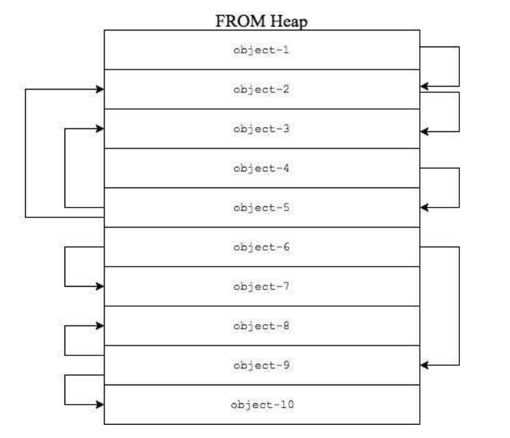

# Final Exam Preparation

## Functional Programming - ML
- Basic:
  - List
  - Records & tuples
    ```sml
    (*recod*){ a = "123" , y = 2 }: {a:string, y:int}
    (*tuple*)(1,2,3) : int * int * int
    ```
  - ML signature & structure
- Feature:
  - Pattern matching
    - What it is? What rules could we use in sml? 
  - Type inference
    - How does the compiler infer the type of a function?
  - Parametric polymorphism
    - What is the type variable? `'a`?
  - Datatype
    - What it is? How to define it? How to use it?
    - Parameterized datatype?
    - Optional type?
- Functions recap:
  - `map`: 
    - applies a function `f` to each element in a list `[a1; ...; an]`, and builds the list [f a1; ...; f an] with the results returned by f.
    - `val map = fn : ('a -> 'b) -> 'a list -> 'b list`
  - `foldl` :
    - `val foldl = fn : ('a * 'b -> 'b) -> 'b -> 'a list -> 'b`
  - `foldr` :
    - `val foldr = fn : ('a * 'b -> 'b) -> 'b -> 'a list -> 'b`

### Exercise
1. **[Type Inference]** For each of the following functions, infer whether they are well-typed. If yes, provide the type of the function. Otherwise, explain the type error.
```sml
(*a*) fun fg x = if x then x andalso(*&&*) x else x + 1
(*b*) fun fi f = f true + f 0
(*c*) fun l NONE = false
          | l (SOME x) = x + 1
(*d*) fun is_large x =
          if x > 37 then true
          else false
(*e HARD*) 
datatype ('a,'b) sum = 
    L of 'a 
  | R of 'b

fun j (L x) = (L(x), L(x))
  | j (R x) = let val (a,b) = x in
  (R(a), R(b))
  end
```

<details><summary>Solution</summary>
    <p>

```
(a) In else branch, the variable x has bool type but operand + expects x be an int type.
(b) The function `f true` forces `f` to be a type of the form `bool -> 'a`, but `f 0` strengths it to be `int -> 'b` for some `'b`.
(c) The return type of the function l are not the same. The first case returns a boolean, but second one returns an integer.
(d) val is_large = fn : int -> bool
(e) val j = fn : ('a,'b * 'c) sum -> ('a,'b) sum * ('a,'c) sum
```
   </p></details>

2. **[Type Inhabitation]** Assume we are given the following algebraic data type and helper function:
```sml
datatype nat = Zero | Succ of nat

fun toInt n = (*fn: nat -> int*)
   case n of
    Zero => 0
   | (Succ n') => (toInt n') + 1

val nat_3 = Succ(Succ(Succ(Zero))); (*nat representation of 3*)
val nat_2 = Succ(Succ(Zero));
```
**Q:** Implement addition `plusNat` and multiplication `multNat` for `nat` datatype.
```sml
- toInt(plusNat nat_2 nat_3);;
val it = 5 : int
- toInt(multNat nat_2 nat_3);;
val it = 6 : int
```
<details><summary>Solution</summary>
    <p>

```sml
fun plusNat x y =
   case x of
    Zero => y
   | (Succ x') => Succ (plusNat x' y)
fun multNat x y =
   case x of
   Zero => Zero
   | (Succ x') => plusNat y (multNat x' y)
```
   </p></details>

## Memory Allocation & Garbage Collection
- Types of Allocation
  - static? stack? heap?
- Allocation methods
  - First fit, Best fit, Worst fit
- Garbage Collection
  - Mark and sweep
    - Each object has an extra bit called the mark bit
    - Mark phase --- the collector traverses the heap and sets the mark bit of each live object encountered
    - Sweep phase --- each object whose mark bit is not set goes on the free list
  - Copying
  - Reference counting
    - Set reference count to 1 when newly object initiated
    - Increment count when copy the pointer to the object
    - Decrement count when a point to the object goes out of scope or stops pointing to the object
    - When count = 0, deallocate this object
    - Real Implementation: Smart Pointer.
  - Ownerships types
    - To move all the reasoning involved in determining which references are alive at what time from run-time to compile-time
### Exercise
1. **[Copying]** Consider the following FROM heap:
<p align="center">

</p>

Assume that the roots point to objects 4 and 6. Draw the FROM and TO space after the call to traverse for each of the roots, assuming they are processed in the order listed above.

2. Consider the following C++ code:
```c++
#include <iostream>
#include "ptr.h"

using namespace std;
int main(){
  Ptr<int> p = new int(5);
  Ptr<int> q;
  q = p;
  cout<<*q<<endl;
  return 0;
}
```
Draw diagrams that illustrate the memory state of the program (including the stack and heap contents) right before each of the following statements in the program is executed:
```
q=p
return 0
```
## Prolog
- Terminology
  - Functors, Atoms, Variables, Rules
- Logical Rule
  - Conjunctions
    - `boy(X) :- young(X), male(X).`
    - Note: Prolog will firstly find a fact to satisfy subgoal `young`, and then use that variable binding to find another fact for subgoal `male`.
   - Disjunctions
    - `happy1(X) :- rich(X); famous(X).`
    - Note: Prolog will firstly match all cases to satisfy subgoal `rich`, and then backtracks to next subgoal `famous`.
- Unification
  - Algorithm?
  - Note: `X = f(X)` leads unification to fail.
- Backtracking
  - Using `trace` mode in Prolog helps you understand the execution order.
- Negation
  ```prolog
  pass(math).
  pass(physics).
  fail(X):- not(pass(X)). // Negation as Failure
  ```
  - Note: you have to consider the universe of `pass` facts is complete. For instance, add some facts for `fail`.

## OOP
- Prototype OOP
  - Def. Object is not related to class. It could be created as an empty object or cloned from an existing object (prototype object).
  - Objects inherit directly from other objects through a prototype property.
    - `__proto__` in JavaScript.
  - Cloning (inheritance) is performed by behaviour reuse.
    - A process of reusing existing objects via delegation that serve as prototypes.
    - Delegation: refers to evaluating a member (property or method) of one object in the context of another original object.
  - For example:
  ```js
  var foo = {one: 1, two: 2};
  var bar = Object.create( foo ); // bar = clone(foo)
  bar.one; // return 1, bar refers foo.a
  bar.three = 3; // add new field
  bar.two = "two"; // add new field two, and shadow proto object's two
  bar;
  /*
  three: 3
  two: "two"
  __proto__:
      name: "foo"
      one: 1
      two: 2
  */
  ```
    - The memory map for objects foo and bar are:
- Class OOP
  - Class? Encapsulation? Inheritance? Dynamic dispatch?
  - Object's allocation
    - In Java, all objects are dynamically allocated on Heap.
    - In C++, objects can be allocated memory **either** on Stack or on Heap.
### Exercise
1. Consider the following c++ code:
```c++
#include <iostream>

using namespace std;
class CLASSA {
public:
    virtual void function_f () {}
    void function_g() {}
};

int main()
{
    CLASSA local_a; // local
    local_a.function_f();
    local_a.function_g();
    CLASSA *dyn_a = new CLASSA(); // dynamic
    dyn_a->function_f();
    dyn_a->function_g();
    CLASSA *ptr_a = &local_a;
    ptr_a->function_f();
    ptr_a->function_g();
    return 0;
}
```
Q: Draw the vtable for class `CLASSA`.

Q: In above method calls, Which method call uses vtable?

## Generic Programming
- Def. a model that allows algorithms pass data type as a parameter when needed for specific types provided.
    - Benefit: writing function / class that will work for many types of data.
- Compilation Process
    - The type parameter annotations in generic classes and methods are only needed at compile time when the program is type checked.
    - Once the compiler has determined that all generic classes are type safe, how to generate the code for generics?
### Templates in C++
- Def. a feature of the C++ programming language that allows functions and classes to operate with generic types.
- Declaring format:
    ```c++
    // Function Templates 
    template <class identifier> function_declaration
    template <typename identifier> function_declaration
    // Class Templates
    template <class identifier> class_declaration
    template <typename identifier> class_declaration
    ```
- There is no much difference between `typename` and `class`. You can use them interchangeably. Here is the [difference](https://stackoverflow.com/questions/2023977/difference-of-keywords-typename-and-class-in-templates).
- For example:
    ```c++
    template<typename T>
    void c_swap(T & a, T & b) //"&" passes parameters by reference
    {
       T temp = b;
       b = a;
       a = temp;
    }
    
    int c = 10, d = 20;
    string hello = "World!", world = "Hello, ";
    c_swap(c, d);
    c_swap( world, hello );
    ```
- How does templates work?
    - The compiler generates the code for the specific types given in the template function call or class instantiation.
    <p align="center">
    
    </p>
- [Template tutorial](http://www.cplusplus.com/doc/oldtutorial/templates/)

### Java generics
- Type erasure
    - Def. refers to the compile-time process by which explicit type annotations are removed from a program.
    - Once type for generic classes is correct, the compiler erases the type annotations by using `Object`.
- For example:
  ```java
  class Test<T> 
  { 
    T obj; 
    Test(T obj) {  this.obj = obj;  }
    public T getObject()  { return this.obj; } 
  }
  ```
- After type erased, the code will be changed to:
  ```java
  class Test
  { 
    Object obj; 
    Test(Object obj) {  this.obj = obj;  }
    public Object getObject()  { return this.obj; } 
  }
  ```
- [Java generics tutorial](https://docs.oracle.com/javase/tutorial/java/generics/index.html)

### Variance (Optional)

- **Q:** suppose we have the types Sparrow, and Bird, where Sparrow is subtypes of Bird. If we have a queue instance of type Queue[Sparrow], can we also use it in situations where we need an instance of type Queue[Bird]?
```java
Queue[Sparrow] = 
```

```java
class A {} 
class B extends A {} 
  
class Base 
{ 
    B fun() 
    { 
        System.out.println("Base fun()"); 
        return new B(); 
    } 
} 

class Derived extends Base 
{ 
    A fun() 
    { 
        System.out.println("Derived fun()"); 
        return new A(); 
    } 
} 
```
## Note
1. Good luck for your exam.
